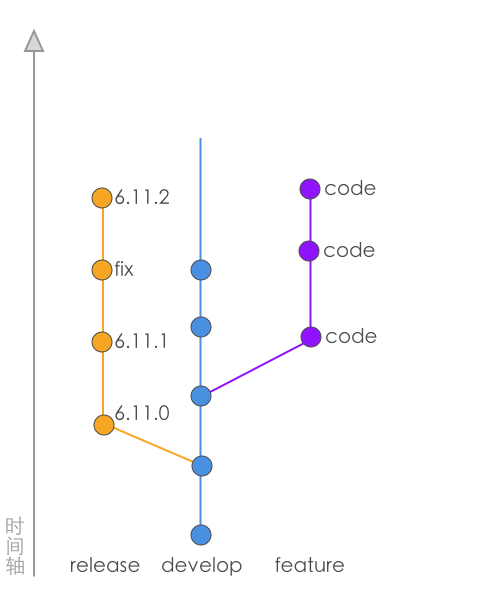

Teambition 工作流规范（暂行）
---------------------------------

### 基本状态示意图



正常的工作流里面，我们会把分支分为 `release`，`develop` 和开发人员的提交分支。

`release` 分支的含义是相对稳定，发布在正式环境上面的代码。这个分支是一个短命分支，里面的更改和优化不会再回溯到 `develop` 分支中去。`bug` 的修复会发布一个小版本；而一个功能发布会重新定义 `release` 分支，以前的就舍弃掉了。

`develop` 分支的含义是一个相对不稳定，可能再开发的阶段的代码。这里面的代码一般情况下是下一个阶段会发布的代码，通常会跑在内测环境上面。


### 提交信息使用中文

团队成员里面大概不会有不认识中文的同学，全体使用中文的话，能够提高可读性。

如果本来英文就不好，然后写出了蹩脚的信息，再让另一个英文不好的同学去阅读，这时候基本很难看明白。

关于使用英文的好处，因为团队里面国外开发人员的情况较少，所以基本不太需要英文来交流；当然，英文还有另外一个好处，那就是在命令行使用的时候，不需要进行输入法切换。


### 分支命名规则

- `feature/xxx-xxx` (命名一个功能分支)
- `issue/xxx-xxx` (命名一个 develop 线上的修复)
- `hotfix/xxx-xxx` (命名一个 release 线上的修复)


### 功能开发

1. 从 `develop` 线上切一个功能分支出来。

2. 持续进行开发，并且在工作结束或者小功能完成的时候，提交临时的 `commit`，这里的提交信息不需要遵守严格的规范，只是临时的保存性提交。

3. 如果 `develop` 线上面发生了明确的基础变化，或者合并了相关的代码变化，那么为了尽早规避代码冲突，应该把当前分支与最新的 `develop` 线进行同步。

  具体操作的话，直接 `merge develop` 然后解决冲突就可以了。

4. 功能经过了基本的测试，认为这是一个需要审核和合并的代码，那么这时整理所有的代码变化，`reset` 到最新的 `develop` 上面，并且写上详细规范的提交信息，提交到远程分支等待审核。

5. 审核人员查看了所有的变化，如果审核未通过，那么提出问题，并且分支状态回到第 3 步，并且重新开发和提交；如果审核通过了，审核人员把代码合并到 `develop` 线，并且删除对应的远程分支。

> 基础变化
>
> 在这里，我们认为代码的重构和优化也是功能开发的一种。

### BUG 修复

1. 查找，引入源，确定目标线。既有可能是新功能开发引入的，也有可能是以前的代码引入的。因为引入源的不同，所以可能分为以下三种情况：
  * 修复到 `develop` 线
  * 修复到 `release` 线
  * 修复到 `release` 和 `develop` 线

2. 开启分支

  * 修复到 `develop` 线

    这个 `bug` 是由 `develop` 上新的代码引入的bug。

    从 `develop` 切一个 `issue/xxx-xxx`分支。

  * 修复到 `release` 线

    老代码引入，并且因为在新的 `develop` 功能开发或者优化中已经解决了。

    从 `release` 切一个 `hotfix/xxx-xxx` 分支。

  * 修复到 `release` 和 `develop` 线

    老代码引入，并且在 `develop` 上面仍然有问题。

    从 `develop` 切一个 `hotfix/xxx-xxx` 分支。

3. 持续进行开发，并且在工作结束或者小功能完成的时候，提交临时的 `commit`，这里的提交信息不需要遵守严格的规范，只是临时的保存性提交。

4. 功能经过了基本的测试，认为这是一个需要审核和合并的代码，那么这时整理所有的代码变化，`reset` 到最新的 目标线上面，并且写上详细规范的提交信息，提交到远程分支等待审核。

5. 审核人员查看了所有的变化，如果审核未通过，那么提出问题，并且分支状态回到第 3 步，并且重新开发和提交。

  如果审核通过了，审核人员把代码合并到目标分支线，并且删除对应的远程分支。

  如果审核人员在合并代码的时候，看见了一个 `develop` 线上的 `hotfix/xxx-xxx` 分支，那么应该主动把代码 `cherry-pick` 到 `release` 分支上去。如果此时产生了冲突，那么放弃这次 `pick` 操作，并且让修复人员再提交一个修复到 `release` 线。

> 老代码？
>
> `release` 和 `develop` 的分歧点以前的共同的代码被称为老代码。


### 提交信息模版

1. [类型] + 标题

  类型有以下几种：

  `FEATURE`： 功能开发

  `ISSUE`： BUG 修复

  `HOTFIX`：线上 BUG 修复

  `UPDATE`：优化和重构

  `DOC`：文档描述

  `RELEASE`: 发布相关的改动

2. 详细描述

  分段描述这个功能的具体内容，BUG 修复的一些具体原因或者注意事项。

3. 机器数据（目前因为还没有自动化工具，所以这部分可以暂时不写）

  `FEATURE` 功能短名，一个功能在开发开始的时候，就应该有一个固定不变的短名来标记这是什么。如果修复一个未上线的

  `TASK` 与分支对应的 Teambition 任务的 ID

  `REVIEWER` 审核人的邮箱或者名字，比如：huaqiao, huaqiao@teambition.com

```
[DOC] 提交模板的标题

这是是描述的第一段信息，用举例说明提交一个合法的提交信息是怎么样的。

这是是描述的第二段信息，用来说明这次提交的一些东西。

FEATURE = 模板
TASK = 56cd5df09c8a6ba82e2bac0a
REVIEWER = huaqiao@teambition.com
```


### 一些题外的话

有时候我会觉得，这样写信息非常得浪费时间，不过呢，写下来总是好的，为以后可能发生的问题提供很多可靠的依据。
